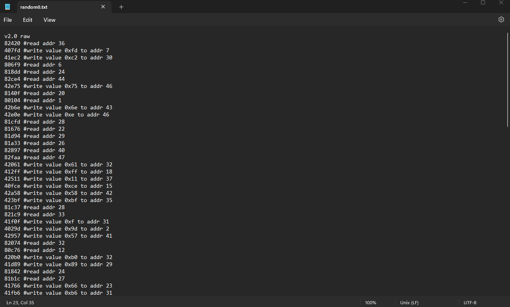
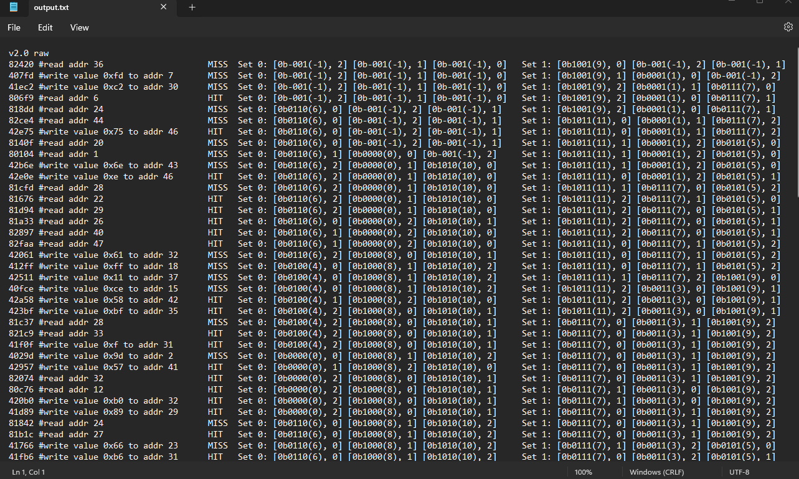

# Test-Debugger
Shows cache contents after each instruction

NOTE: ONLY USE ON INSTRUCTION FILES

Before:

After:

Instructions: You only need the modTests.py file, click on it and you can download the raw python script and you should be able to run it on any instruction file.
